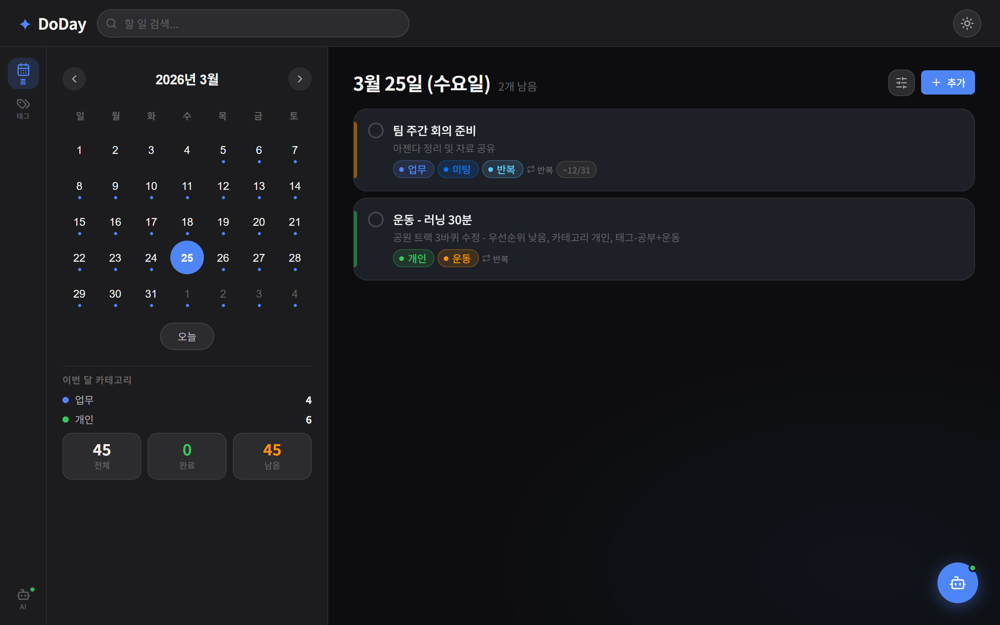
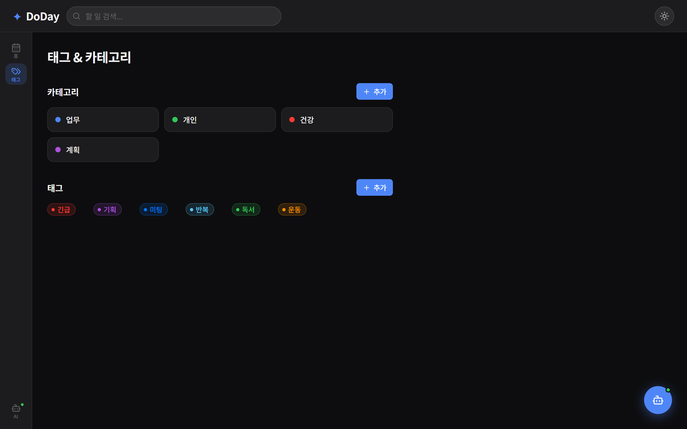
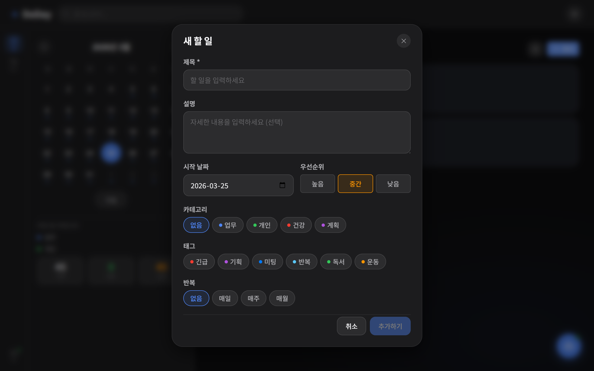
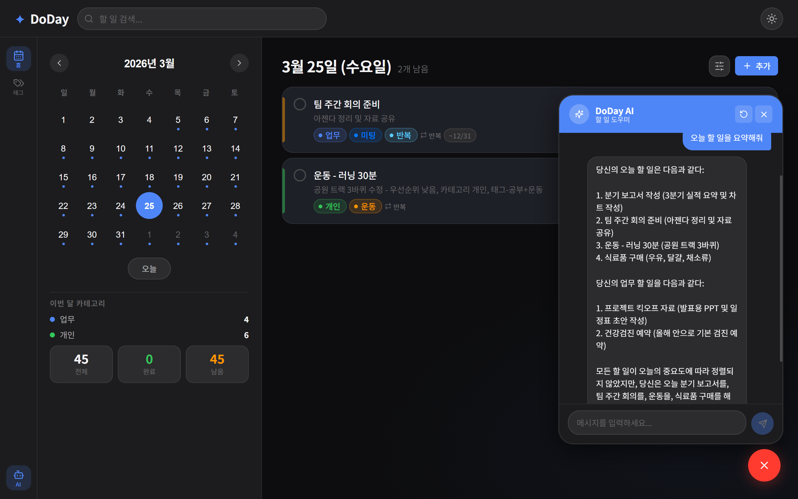

# 🗓Todo App

### 주요 기능
- 캘린더에 Todo 항목 표기
- 날짜 선택시 우측 화면에 해당 날짜 Todo 목록 표기
- Todo 등록시 카테고리, 태그, 우선순위 설정
- 반복 일정 제공 (매일, 매주(요일), 매월)
- 카테고리 및 태그 추가 및 삭제 기능
- Ai chat bot 으로 일정 관련 대화 가능
  
---

## 📷화면 구성
| 캘린더 | Todo 등록 |
|--------|----------|
|  |  |

| 태그 | 챗봇 |
|-----------|----------|
|  |  |

---

## 📂프로젝트 구조

```
todo_prj
├─ frontend
│   ├─ api
│   ├─ assets
│   ├─ components
│   ├─ context
│   ├─ hooks
│   ├─ lib
│   └─ pages
└─ backend
    ├─ cors
    ├─ controller
    ├─ dto
    ├─ entity
    ├─ service    
    └─ repository
```

---

## 🎨frontend

### 기술 스택
|항목|상세|
|-----------|-----|
|React      |18+  |
|번들러      |vite  |
|HTTP Client  |axios  |

---

## ⚙backend

### 기술스택
|항목|상세|
|------------|----------------|
|Spring boot | 4.0.4 |
|Build        |Gradle|
|ORM|JPA|
|DB|Maria DB|
|AI|groq|
|model|llama-3.1-8b-instant|
